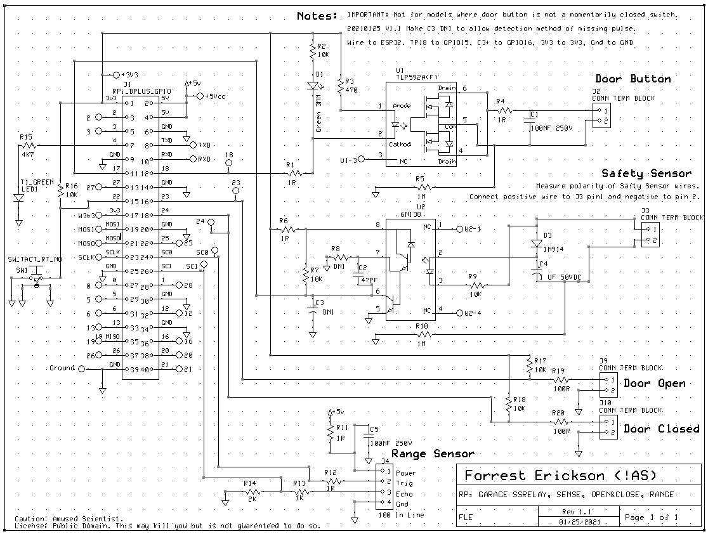
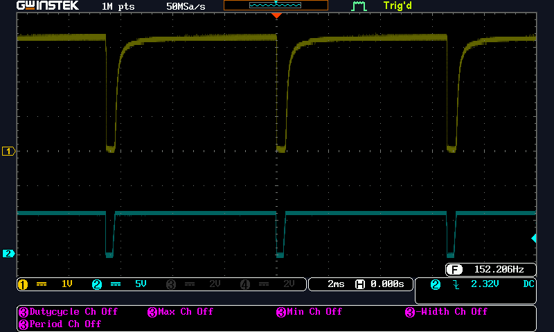

# MissingPulseDetector
Detects a 300uS pulse every 6.6mS such as from a garage door safety sensor.

Brief description  
ESP32 project with an interface to an optical isolator connected to the safety sensor on a garage door.

How to build  
Arduino IDE version 1.8.13 used.  
The schematic and PCB were done in ExpressPCB.

How to use this  
Watch the on board LED which will be lit when the sensor is reporting safe.
LED will be off when the sensor is interupted or when the sensor goes to sleep.

License / Dedication  
Public Domain.

Schematic

 
 
PCB  

Wiring photograph  

Oscilloscope waveforems of pulses. CH1 is at C3+ on schematic and CH2 is at J3 pin 1.  

